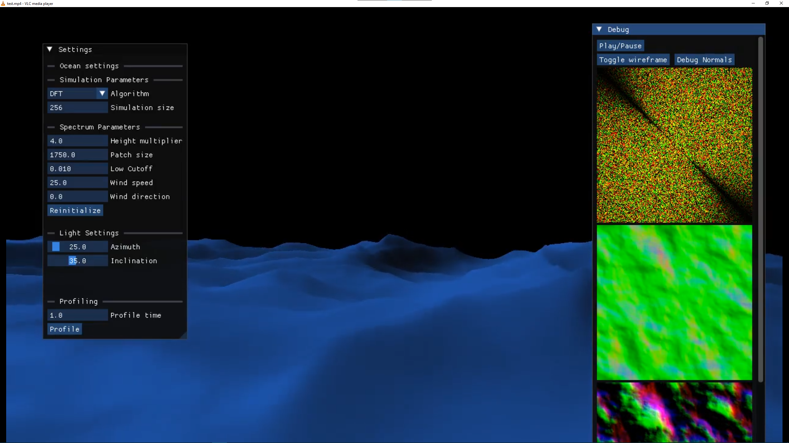

# Graphics Development Server

[](test.mp4)

This project was born out of a need to improve my remote development workflow. Traditional solutions like Remote Desktop or Parsec create too much friction, and native X11 forwarding doesn't work on Windows. This repository serves as a proof-of-concept for selectively forwarding a single remote application window to a local client.

### Technical approach & Progress

The current iteration focuses on the capture pipeline rather than the networking layer. To capture frame with minimal overhead, I implemented:
- __DLL injection & Function Hooking__ - to intercept the OpenGL render loop.
- __Frame Capture__ - extracting raw frame data from the graphics context.
- __Encoding__ - using FFmpeg to encode and mux captured frames into an `mp4` container.

### Project status

While successful as a specialized OpenGL capture tool, this approach is limited. I have since discovered the native Windows Capture API, which offers a more robust solution for client area window capture.

Active development will be moved in the future to a new repository. This repository remains as a demo of the DLL injection and OpenGL hooking solution.

## Requirements

- CMake 3.30
- MinGW 13.2.0 MSVCRT (or equivalent)
- vcpkg

## Dependencies

- FFmpeg
- minhook
- Boost ASIO (not used)

## Building

```
git clone github.com/Rocco2300/graphics-dev-server

cd graphics-dev-server
mkdir build && cd build
cmake .. -G "MinGW Makefiles" -DBUILD_SHARED_LIBS=OFF -DCMAKE_TOOLCHAIN_FILE=<path_to_vckpg.cmake> -DVCPKG_TARGET_TRIPLET=x64-mingw-static
cmake --build .

cd ../bin
./graphics-dev-srv.exe <path_to_app>
```

Keep in mind that you will have to modify the path from server.cpp to point to your bin directory.